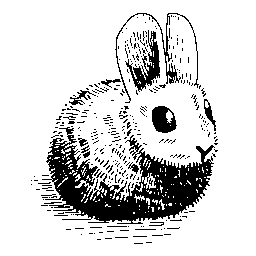
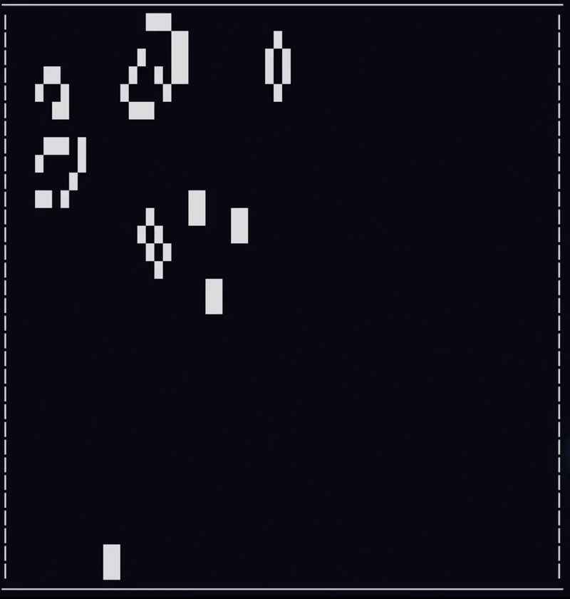

# Conway's Game of Life in Hare programming Language



Classic implementation of 
<a href="https://en.wikipedia.org/wiki/Conway%27s_Game_of_Life">Connway's Game of Life</a>
in the cool new <a href="https://harelang.org/">Hare</a> programming language.

## To build

```
hare build -o game-of-life game_of_life.ha
```

## To run
Enter random seed (as number) for random initial conditions;

```
./game-of-life
```
or
```
hare run
```


## TODO
- [ ] Make initial condition better to have longer runs of changes
- [ ] Allow for option to manually select cells to start with
